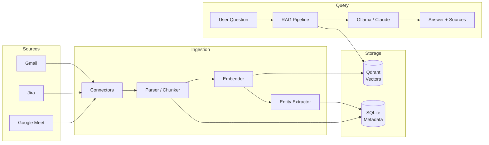

# Bitig

[](https://opensource.org/licenses/MIT)
[](https://www.python.org/downloads/)
[](https://www.docker.com/)

> **Bitig** (Old Turkic: "inscription, book, document") -- An open-source, self-hostable personal work memory platform.

Bitig automatically ingests your work data (Gmail, Jira, Google Meet transcripts), extracts entities and relationships, and lets you query everything with natural language.

## Features

- **Multi-source ingestion** -- Gmail, Jira, Google Meet transcripts
- **Vector search** -- Powered by Qdrant and sentence-transformers (local embeddings)
- **RAG chat** -- Ask natural language questions about your work history
- **Entity extraction** -- Automatically identifies people, tickets, decisions, topics
- **Relationship graph** -- Visualize connections between entities
- **Privacy-first** -- All data stays local, no external API calls required (Ollama default)
- **Self-hostable** -- Single `docker compose up` to get started

## Quick Start

### Prerequisites

- Docker and Docker Compose
- (Optional) Ollama running locally for LLM inference

### 1. Clone and configure

```bash
git clone https://github.com/your-username/bitig.git
cd bitig
cp .env.example .env
# Edit .env with your API keys and configuration
```

### 2. Start all services

```bash
docker compose up -d
```

This starts:
- **Backend** (FastAPI) on `http://localhost:8000`
- **Frontend** (Next.js) on `http://localhost:3000`
- **Qdrant** on `http://localhost:6333`
- **Ollama** on `http://localhost:11434`

### 3. Using external Qdrant/Ollama

If you already have Qdrant or Ollama running, update `.env` with their URLs and use only the backend + frontend services:

```bash
docker compose up backend frontend -d
```

## Architecture



## Tech Stack

| Component | Technology |
|-----------|-----------|
| Backend | Python 3.11+, FastAPI |
| Vector DB | Qdrant |
| Embeddings | sentence-transformers (local) |
| LLM | Ollama (default) / Claude API |
| Frontend | Next.js, Tailwind CSS, shadcn/ui |
| Metadata | SQLite |

## Development

```bash
# Install dependencies
uv venv && source .venv/bin/activate
uv pip install -e ".[dev]"

# Run backend locally
uvicorn src.main:app --reload

# Lint and format
ruff check --fix src/ tests/
ruff format src/ tests/

# Run tests
pytest
```

## License

This project is licensed under the MIT License -- see the [LICENSE](LICENSE) file for details.
