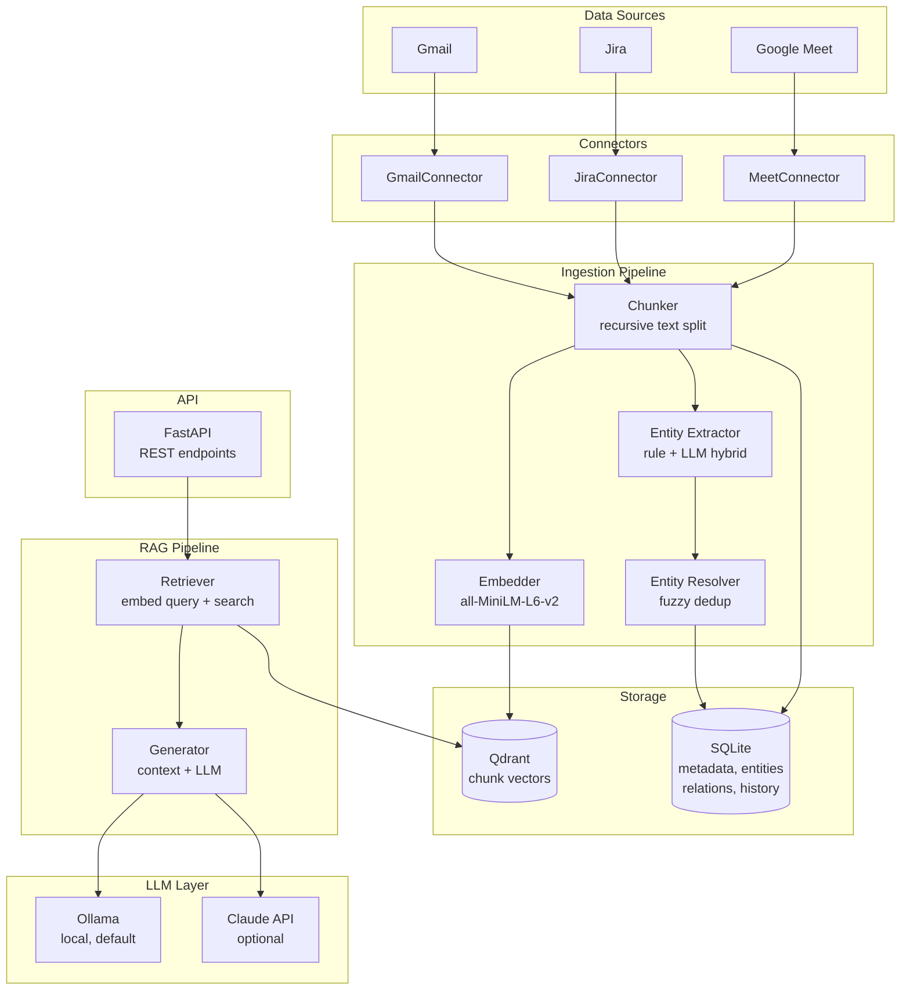

# Architecture

## Overview

Bitig is a privacy-first personal work memory platform. It ingests data from work tools (Gmail, Jira, Google Meet), processes it through an ingestion pipeline, and enables natural language querying via RAG.

## System Diagram



## Data Flow

### Ingestion

1. **Connector** fetches raw documents from a data source (API call or file read)
2. **Chunker** splits documents into overlapping text chunks (default: 512 chars, 64 overlap)
3. **Embedder** generates 384-dim vectors using sentence-transformers (all-MiniLM-L6-v2)
4. **Entity Extractor** runs hybrid extraction:
   - Rule-based: emails (→ person), ticket patterns like `PROJ-123` (→ ticket)
   - LLM-based: persons, projects, topics, decisions, action items
5. **Entity Resolver** deduplicates entities using fuzzy matching (thefuzz, threshold: 85)
6. Vectors are stored in **Qdrant**, metadata/entities/relations in **SQLite**

### Query (RAG)

1. User sends a natural language question via `POST /api/chat`
2. **Retriever** embeds the query and searches Qdrant for top-k similar chunks
3. **Generator** formats retrieved chunks as context and sends to LLM
4. LLM generates an answer citing sources
5. Response + sources are saved to chat history

## Module Map

```
src/
├── main.py              # FastAPI app + lifespan (resource init)
├── config.py            # Pydantic Settings from .env
├── dependencies.py      # FastAPI dependency injection
├── api/                 # HTTP layer
│   ├── router.py        # Combines all routers
│   ├── middleware.py     # X-API-Key auth
│   ├── health.py        # GET /api/health
│   ├── chat.py          # POST /api/chat, GET /api/chat/history
│   ├── connectors.py    # GET/POST /api/connectors
│   ├── entities.py      # GET /api/entities
│   └── ingestion.py     # GET /api/ingestion/stats
├── connectors/          # Data source adapters
│   ├── base.py          # BaseConnector ABC
│   ├── gmail.py         # Google API
│   ├── jira.py          # REST API + ADF parser
│   └── meet.py          # VTT/SRT/TXT transcript parser
├── ingestion/           # Processing pipeline
│   ├── chunker.py       # Text splitting + Document conversion
│   ├── embedder.py      # sentence-transformers wrapper
│   └── pipeline.py      # Orchestrator
├── entity/              # Entity processing
│   ├── extractor.py     # Hybrid rule + LLM extraction
│   └── resolver.py      # Fuzzy deduplication
├── rag/                 # Query pipeline
│   ├── retriever.py     # Query embed + Qdrant search
│   ├── generator.py     # Context formatting + LLM call
│   └── pipeline.py      # Orchestrator + history save
├── llm/                 # LLM abstraction
│   ├── base.py          # BaseLLM ABC
│   ├── ollama.py        # Ollama /api/generate
│   └── claude.py        # Anthropic SDK
├── store/               # Persistence
│   ├── qdrant.py        # Async Qdrant client wrapper
│   └── metadata.py      # SQLite CRUD (aiosqlite)
└── models/              # Pydantic schemas
    ├── document.py      # RawDocument, Document, Chunk
    ├── entity.py        # Entity, Relation, EntityGraph
    ├── chat.py          # ChatRequest, ChatResponse
    └── connector.py     # ConnectorState, IngestionStats
```

## Key Design Decisions

| Decision | Choice | Why |
|----------|--------|-----|
| Default LLM | Ollama (local) | Privacy-first, no data leaves the machine |
| Embedding | sentence-transformers (local) | No API calls, fast, 384-dim vectors |
| Vector DB | Qdrant | Async client, filtering, production-ready |
| Metadata DB | SQLite | Zero config, embedded, sufficient for single-user |
| Entity extraction | Hybrid (rules + LLM) | Rules catch structured patterns reliably, LLM handles unstructured |
| Entity dedup | Fuzzy matching (thefuzz) | Handles typos and name variations |
| Auth | API key header | Simple, sufficient for self-hosted single-user |
