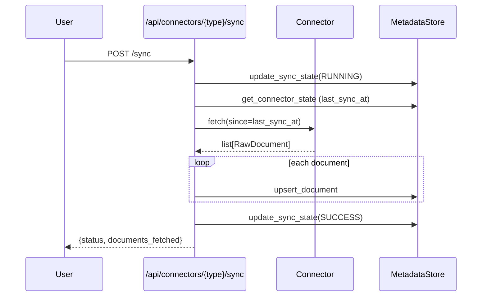

# Connectors

Connectors are the data source adapters that fetch documents from external services. All connectors extend `BaseConnector` (defined in `src/connectors/base.py`).

## BaseConnector Interface

```python
class BaseConnector(ABC):
    @property
    def connector_type(self) -> ConnectorType: ...
    def is_configured(self) -> bool: ...
    async def fetch(self, since: datetime | None = None) -> list[RawDocument]: ...
```

## Built-in Connectors

### Gmail

**File:** `src/connectors/gmail.py`

Fetches emails via Google Gmail API. Handles multipart messages and extracts plain text body.

**Configuration:**
```env
GMAIL_CREDENTIALS_PATH=/path/to/credentials.json
```

**Setup:**
1. Create a Google Cloud project
2. Enable Gmail API
3. Create OAuth2 credentials (Desktop app type)
4. Run initial auth flow to generate `credentials.json`
5. Set `GMAIL_CREDENTIALS_PATH` in `.env`

**What it fetches:**
- Subject → `title`
- Plain text body → `content`
- From/To → `metadata`
- Date → `timestamp`
- Message ID → `source_id`

### Jira

**File:** `src/connectors/jira.py`

Fetches issues via Jira REST API v3. Handles Atlassian Document Format (ADF) for descriptions, extracts comments.

**Configuration:**
```env
JIRA_URL=https://your-org.atlassian.net
JIRA_EMAIL=your-email@example.com
JIRA_API_TOKEN=your-api-token
```

**Setup:**
1. Go to [Atlassian API Tokens](https://id.atlassian.com/manage-profile/security/api-tokens)
2. Create an API token
3. Set all three env vars in `.env`

**What it fetches:**
- `[KEY] Summary` → `title`
- Description + comments → `content`
- Status, assignee, priority → `metadata`
- Issue key → `source_id`
- Paginated (50 per page)

### Google Meet

**File:** `src/connectors/meet.py`

Parses local transcript files. Supports `.txt`, `.vtt`, and `.srt` formats. VTT/SRT files are automatically cleaned (timestamps and sequence numbers removed).

**Configuration:**

No env var yet -- pass `transcripts_dir` when constructing. Files are read from a local directory.

**What it fetches:**
- Filename → `title` (underscores/hyphens replaced with spaces)
- File content (cleaned) → `content`
- File modification time → `timestamp`
- File stem → `source_id`

## Adding a New Connector

1. Create `src/connectors/your_source.py`
2. Extend `BaseConnector`:

```python
from src.connectors.base import BaseConnector
from src.models.connector import ConnectorType
from src.models.document import RawDocument

class YourConnector(BaseConnector):
    @property
    def connector_type(self) -> ConnectorType:
        return ConnectorType.YOUR_SOURCE  # add to enum first

    def is_configured(self) -> bool:
        return self._api_key is not None

    async def fetch(self, since=None) -> list[RawDocument]:
        # Fetch and return RawDocument list
        ...
```

3. Add new type to `ConnectorType` enum in `src/models/connector.py`
4. Register in `create_connectors()` in `src/connectors/__init__.py`
5. Add config fields to `Settings` in `src/config.py`
6. Write tests in `tests/test_connectors/test_your_source.py`

## Sync Flow


